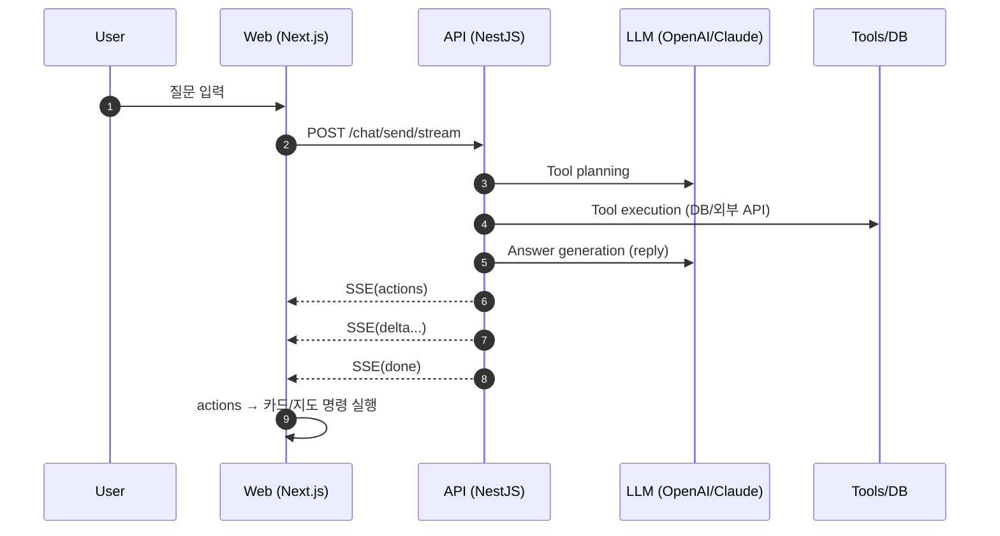

# 🏪 Alley - 상권 분석 AI 플랫폼


> **거리 위 데이터를 전략적 가치로**  
> 상권·업종 데이터를 기반으로 창업 입지를 분석하고,  
> AI 챗을 통해 매출·생존율·손익분기점을 대화형으로 제공하는 플랫폼입니다.

- 배포 URL: https://star-ter.shop
  <br>

## 프로젝트 소개

- 서울시 상권 데이터를 기반으로 **창업 입지 분석**을 제공하는 서비스입니다.
- **AI 챗봇**을 통해 자연어로 상권을 분석하고, 매출/생존율/손익분기점 등 핵심 지표를 차트로 시각화합니다.
- 카카오맵 기반 **지도 연동**으로 상권 폴리곤, 매물 마커, 유동인구 히트맵을 직관적으로 확인할 수 있습니다.

<br>

## 프로젝트 시연

Alley 서비스의 주요 기능을 담은 시연 영상입니다.  
상권 분석부터 AI 챗 분석까지 한눈에 확인해보세요!

- 시연 영상: https://www.youtube.com/watch?v=WQJ41tTqtSc

<br>

## 팀원 구성

<div align="center">

|                                  **이정훈**                                  |                                  **방은규**                                   |                                  **정민수**                                   |                                  **이태우**                                   |                                  **조희원**                                   |                                  **장봉익**                                   |
| :--------------------------------------------------------------------------: | :---------------------------------------------------------------------------: | :---------------------------------------------------------------------------: | :---------------------------------------------------------------------------: | :---------------------------------------------------------------------------: | :---------------------------------------------------------------------------: |
|                    [@Jeongns](https://github.com/Jeongns)                    |                 [@EungyuBang](https://github.com/EungyuBang)                  |                    [@psd0116](https://github.com/psd0116)                     |                [@thisisyello](https://github.com/thisisyello/)                |               [@neverthe1ess](https://github.com/neverthe1ess)                |                       [@sd4y](https://github.com/sd4y)                        |
|  |  |  |  |  |  |

</div>

<br>

## 핵심 요약

- **Monorepo**: `apps/web`(Next.js) + `apps/api`(NestJS) + Turborepo
- **AI Chat**: OpenAI/Claude 기반 tool(function)-calling + SSE 스트리밍(`POST /chat/send/stream`)
- **상권 분석 카드**: 매출/생존/손익분기/매물 추천/유사 상권 카드
- **지도 연동**: 카카오맵 기반 마커/상권 폴리곤/건물 폴리곤 표시
- **배포**: GitHub Actions → ECR 빌드/푸시 → ECS(EC2) 롤아웃 (`.github/workflows/deploy-ecs.yml`)

---

## 1. 기술 스택

- **Front**: Next.js 16 (App Router, React 19), Zustand, Tailwind CSS v4, Recharts
- **Back-end**: NestJS 11, Prisma 7, PostgreSQL, Passport (JWT/OAuth)
- **AI**: OpenAI GPT-4o mini / Anthropic Claude 4.5 haiku
- **Infra**: AWS ECS, ECR, RDS, S3
- **버전 및 이슈관리**: GitHub, GitHub Issues
- **협업 툴**: Notion, Slack
- **CI/CD**: GitHub Actions → AWS ECR/ECS
- **지도**: Kakao Maps SDK

<br>

## 2. 시스템 아키텍처


Alley 서비스는 AWS 기반 인프라로 구성되어 있습니다.

- **프론트엔드**: Next.js App Router 기반, Vercel/ECS 배포
- **백엔드**: NestJS API 서버, ECS 배포
- **데이터베이스**: AWS RDS (PostgreSQL)
- **AI 연동**: OpenAI/Anthropic API 호출
- **지도**: Kakao Maps SDK

### AI 챗 흐름 (Sequence Diagram)



<br>

## 3. 커밋 컨벤션

| 태그       | 설명                                                            |
| ---------- | --------------------------------------------------------------- |
| `feat`     | 새로운 기능 추가                                                |
| `fix`      | 버그 수정                                                       |
| `refactor` | 코드 리팩토링 (기능 변경 없음)                                  |
| `merge`    | 브랜치 병합 작업 (e.g. `feat/auth` → `develop`), 충돌 해결 포함 |

<br>

## 4. 역할 분담

### 🎨 이정훈 (팀장)

- 프로젝트 기획 및 총괄
- 데이터 수집 및 데이터베이스 적재
- AI 구조 설계

### 💻 방은규

- 상권 추천 카드 기능, UI/UX 컴포넌트 개발
- 사용자 온보딩 데이터를 활용한 맞춤 추천 알고리즘 설계
- 부동산 데이터 테이블 설계 및 데이터 적재

### 🔧 정민수

- 유동인구 파이프라인 구성
- 시계열 데이터 시각화 기능 구현(히트맵)
- 실시간 상권 찾기 페이지(랭킹 및 검색 기능) 구현

### ⌨️ 이태우

- 업종코드 매핑 테이블 설계
- UI/UX 총괄 및 디자인 시스템 구성
- 상권 상세 페이지 내 개폐업 데이터 시각화

### 💾 조희원

- 상세 페이지 / 메인 페이지 / 랜딩 페이지 UI 디자인 초기 설계
- LLM + Function Calling 파이프라인 설계
- CI/CD 파이프라인 구축

### 🎮 장봉익

- LLM UI 초기 설계
- 로그인 페이지 연동 작업(구글)
- QA 및 지도 검색 이동 기능 구현

<br>

## 5. 개발 기간

- **전체 개발 기간**: 2025.12 ~ 2026.01 (약 2개월)
- **아이디어 기획**: 2025.12.18 ~ 2025.12.24
- **MVP 개발**: 2025.12.25 ~ 2026.01.07
- **폴리싱 및 배포**: 2026.01.08 ~ 2026.01.24

<br>

## 6. 페이지별 기능

### [메인 홈 - 상권 탐색]

- **상권 목록/탐색 UI**: 매출/유동인구/폐업률/MZ 선호 등 랭킹 기반 탭 탐색
- **맞춤 추천**: 온보딩(창업 선호 조건) 데이터를 기반으로 추천 상권을 점수화해서 제안


관련 코드:

- 상권 탐색/추천 페이지: `apps/web/components/LocationSearchPage.tsx`
- 상권 상세 라우팅/데이터 페칭: `apps/web/app/locations/detail/[code]/page.tsx`

<br>

### [상권 상세 대시보드]

하나의 상권을 "지도 중심"으로 분석하는 화면입니다.

- **탭 구성**: 업종 매칭도 / 유동인구 / 업종·매출 분석 / 부동산 / 뉴스
- **지도(카카오맵)**: 상권 폴리곤 표시 + 지도 리사이즈(패널 드래그) + 현재 지도 bounds 기반 리스트 필터링
- **유동인구(히트맵)**: 시간대 자동 재생 + 성별/연령대 필터로 트래픽 패턴 확인
- **업종·매출 분석**: 선택 업종에 대해 점포/경쟁 강도를 오버레이로 시각화
- **부동산 탭**: 매물 마커/리스트 연동 + 보증금/월세/지도 범위 필터 + 상세 패널

|  |  |
| --------------------------------------------------------------------------------------------------- | --------------------------------------------------------------------------------------------------- |

관련 코드:

- 상세 페이지 UI: `apps/web/components/LocationDetailPage.tsx`
- 상세 지도/오버레이: `apps/web/components/location-detail/MapSection.tsx`
- 유동인구 레이어: `apps/web/components/location-detail/hooks/usePopulationLayer.ts`
- 점포/경쟁 오버레이: `apps/web/components/location-detail/hooks/useStoreLocations.ts`

<br>

### [AI 챗 - 상권 분석]

- 유저 질문 → 백엔드에서 **도구 계획(Planner)** → **도구 실행(Tools/DB)** → **답변 생성(Answer Provider)** 흐름으로 동작
- 응답은 `reply`(텍스트) + `actions`(프론트에서 실행할 "명령"들)로 구성
- **SSE 스트리밍**: `actions`(선행) → `delta`(토큰 스트림) → `done` 순으로 이벤트를 내려 UX를 빠르게 만듦
- **대화 히스토리**: 대화 목록/기록 조회 및 재생(히스토리 기반 카드/지도 액션 복원)


관련 코드:

- 오케스트레이터: `apps/api/src/ai/core/ai-chat-orchestrator.service.ts`
- 스트리밍 API: `apps/api/src/ai/chat.controller.ts`
- 대화 목록/히스토리 API 호출: `apps/web/services/chat/chat.api.ts`
- 프론트 챗 페이지: `apps/web/components/chat/ChatPage.tsx`

<br>

### [차트/카드 (UI Artifacts)]

LLM의 `actions`를 기반으로 프론트에서 카드 컴포넌트를 렌더링하고, 필요 데이터는 백엔드 "차트 데이터 API"로 조회합니다.


관련 코드:

- API: `apps/api/src/ai/ai.controller.ts`
- 프론트 카드 타입: `apps/web/components/chat/charts/types.ts`
- 액션→카드/지도 명령 변환: `apps/web/components/chat/actions/actionProcessor.ts`

<br>

### [지도 연동 (카카오맵)]

AI 액션 결과를 지도에 반영합니다.

- 마커 표시: `map.setMarkers` (유사 상권/매물 등)
- 상권 폴리곤 표시: `map.showCommercialArea`
- 유사 상권처럼 여러 마커를 한 번에 보여줘야 할 때는 `fitBounds`로 자동 줌/이동
- **컨테이너 폭이 작은 순간(패널 열림 직후)** `setBounds`가 오동작할 수 있어, 폭이 충분할 때까지 **fitBounds 지연 적용** 로직 포함

관련 코드:

- 지도 섹션: `apps/web/components/chat/ChatMapSection.tsx`
- 카카오맵 로더: `apps/web/hooks/useKakaoMap.ts`

---

## 폴더 구조

```text
.
├─ apps/
│  ├─ web/                  # Next.js 프론트엔드
│  └─ api/                  # NestJS 백엔드
├─ docker/
│  └─ docker.compose.yml    # 로컬 개발용(Postgres/Valkey)
├─ infra/ecs/               # ECS task definition
└─ docs/                    # 개발 문서/계획
```

---

## 로컬 실행

### 0) 요구사항

- Node.js `>= 18`
- pnpm `9.x`
- (권장) Docker
- (권장) PostgreSQL에 `pgvector`/지리 확장(PostGIS 등)이 준비된 환경

### 1) DB/캐시 실행(선택, Docker)

```bash
docker compose -f docker/docker.compose.yml up -d
```

> ⚠️ **주의**: docker-compose는 빈 데이터베이스만 생성합니다.  
> 실제 상권 데이터(매출, 유동인구, 점포 등)는 **별도 DB 덤프 파일** 또는 **운영 RDS 연결**이 필요합니다.

### 2) 환경변수 설정

프론트 (`apps/web/.env`)

```bash
NEXT_PUBLIC_API_BASE_URL=
NEXT_PUBLIC_KAKAO_MAP_API_KEY=
```

백엔드 (`apps/api/.env`)

```bash
PORT=
ALLOW_ORIGIN=
DATABASE_URL=
OPENAI_API_KEY=
ANTHROPIC_API_KEY=

# (선택) Google OAuth
GOOGLE_CLIENT_ID=
GOOGLE_CLIENT_SECRET=

# (선택) Naver News API
NAVER_CLIENT_ID=
NAVER_CLIENT_SECRET=

# (선택) 이미지 업로드
AWS_ACCESS_KEY_ID=
AWS_SECRET_ACCESS_KEY=
AWS_REGION=
AWS_S3_BUCKET=
```

### 3) 의존성 설치

```bash
pnpm install
```

### 4) 개발 서버 실행

```bash
pnpm dev
```

- Web: `http://localhost:3000`
- API: `http://localhost:4000`

### (선택) 앱만 따로 실행

```bash
# API만
pnpm -C apps/api dev

# Web만
pnpm -C apps/web dev
```

---

## 스크립트

```bash
pnpm dev         # 전체(터보) 개발 서버
pnpm build       # 전체(터보) 빌드
pnpm lint        # 전체(터보) 린트
pnpm check-types # 전체(터보) 타입체크
pnpm format      # prettier
```

---

## 배포

- GitHub Actions: `.github/workflows/deploy-ecs.yml`
- ECS Task Definition: `infra/ecs/taskdef-web.json`, `infra/ecs/taskdef-api.json`
- 배포 흐름: main 브랜치 push → ECR build/push → ECS service 업데이트

---
